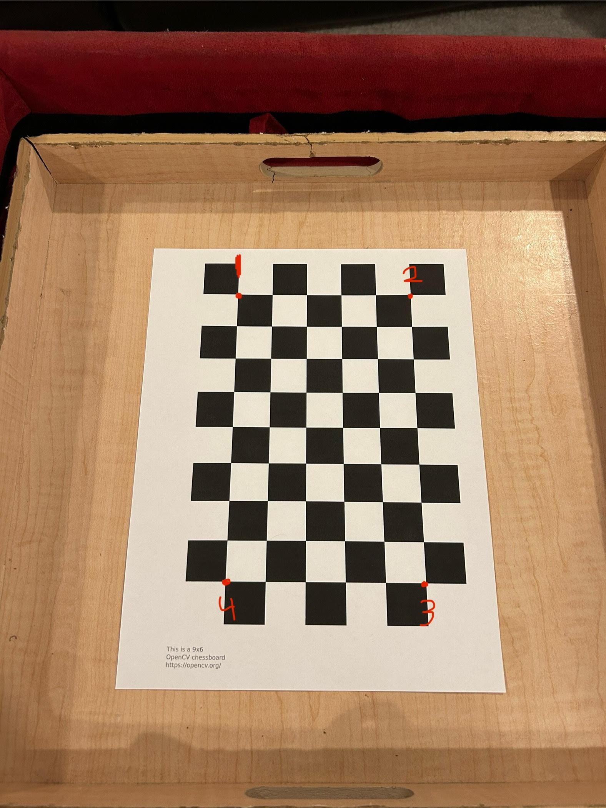

# Prenith and Drew Estimate Camera Poses
---
This repo is an an attempt to derrive camera pose from pre-derrived camera intrinsics and user selected points on an image with known parameters.
   
## Run Locally 
---
1. **Clone the Repository**:
   ```bash
   git clone https://github.com/a3d2ddk/Prenith-and-Drew-Estimate-Camera-Poses.git
   cd Prenith-and-Drew-Estimate-Camera-Poses

2. **Install Required Python Libraries**
   It may be smart to use a Python enviornment manager like Anaconda or a Virtual Enviornment.
   ```bash
   !pip install numpy opencv-python matplotlib gradio pillow pytransform3d

3. **Run the Notebook**
   By cloning the repo you already downloaded the intrinsics of the images in the [test-images](test-images) directory.
   The only thing left to do is run:
   ```bash
   jupyter notebook

## Run in Colab
---
1. **Open the Repository**:
   To use this in a Google Colab you can simply open [Colab](https://colab.research.google.com), click File -> Open Notebook -> , then paste the [repo link](https://github.com/a3d2ddk/Prenith-and-Drew-Estimate-Camera-Poses) and open the pose_estimation_with_gradio.ipynb.
   
## How to Use the Gradio UI
---
1. **Upload an Image**:
   Click on the "Upload Image" area to select an image where you want to estimate the camera pose. If you are using Colab you should download the images from the colab files cloned in when the notebook cells are run.

2. **Select Points**:
   Click on the image to select points. The points that should be selected are one square inward from the outer rectangle. These four corners will make a rectangle that is 5x8 squares. The pointa should be selected clockwise where the first two corners selected make the short side of the rectangle.
   Below is shown the correct selection of corners:
   
   
   
   The selected points will be displayed with small orange dots and mistakes can be undone or all points can be cleared with the relative buttons.

4. **Process Points**:
   After selecting the desired points, click the **Process Points** button to estimate the camera pose. The results will be displayed in the following areas:
   - **Homography to Pose**: Displays the homography matrix.
   - **OpenCV solvePnP**: Displays the results from OpenCV's pose estimation.
   - **Coordinate Axes Overlay**: Shows the coordinate axes overlay on the uploaded image.
   - **3D Camera Pose**: Visualizes the estimated camera pose in 3D.
